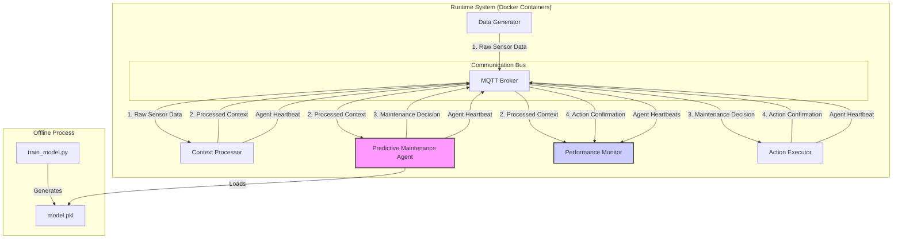
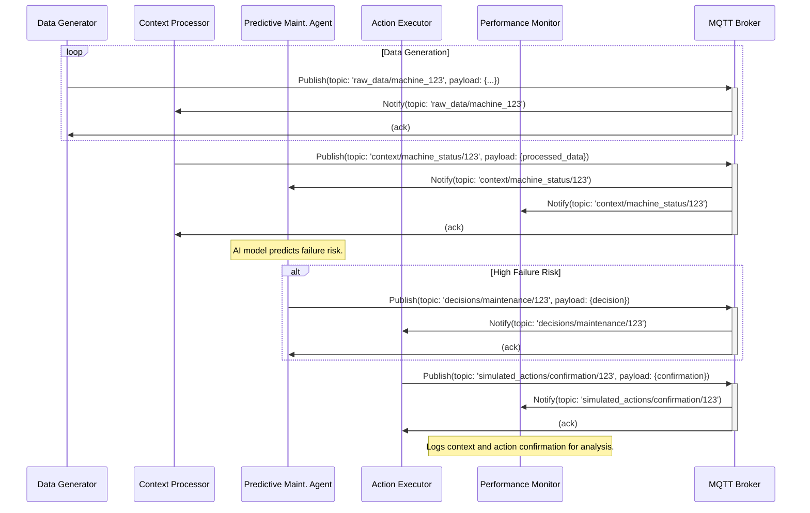

# Smart Factory Predictive Maintenance

A Docker-based simulation of a Smart Factory environment. This project implements a multi-agent system where agents communicate over MQTT to perform predictive maintenance on industrial machinery. The system includes agents for data generation, context processing, AI-driven decision-making, and action execution.

## Getting Started

Follow these instructions to get the project up and running on your local machine.

### Prerequisites

Make sure you have the following installed:

*   [Docker](https://www.docker.com/get-started)
*   [Docker Compose](https://docs.docker.com/compose/install/) (usually included with Docker Desktop)

### Training the Predictive Model (Optional)

The predictive maintenance agent uses a pre-trained model. If you wish to retrain the model with new data, you can run the training script.

1.  **Navigate to the root directory:**
    ```sh
    cd .
    ```

2.  **Run the training script:**
    This will generate a new model file inside the `predictive_maintenance_agent` directory.
    ```sh
    python3 train_model.py
    ```

### Running the Application

1.  **Clone the repository:**
    ```sh
    git clone https://github.com/sudhindrakini2808/smart-factory-predictive-maintenance.git
    cd smart-factory-predictive-maintenance
    ```

2.  **Build and run the services:**
    Use Docker Compose to build the images and start all the services in detached mode (`-d`).
    ```sh
    docker-compose up --build -d
    ```

3.  **View logs (optional):**
    To see the logs from all running containers, you can use:
    ```sh
    docker-compose logs -f
    ```
    Or to follow a specific service (e.g., `predictive_maintenance_agent`):
    ```sh
    docker-compose logs -f predictive_maintenance_agent
    ```

4.  **Stopping the application:**
    To stop and remove the containers, run:
    ```sh
    docker-compose down
    ```

## System Architecture and Flow

### Architecture Diagram

This diagram shows the high-level architecture of the system. It's a microservices-based system where each component is a Docker container, communicating via an MQTT Broker.



### Interaction Diagram (Sequence)

This sequence diagram illustrates the step-by-step flow of messages for a single predictive maintenance event.


